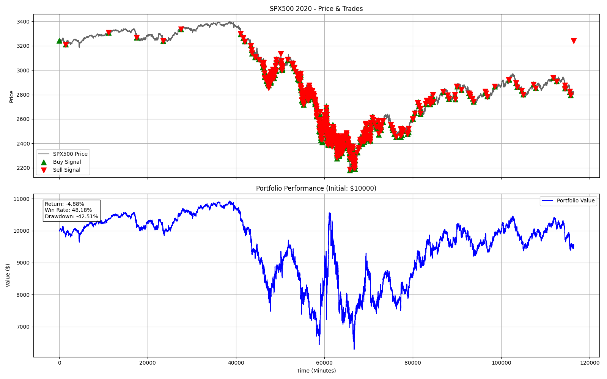
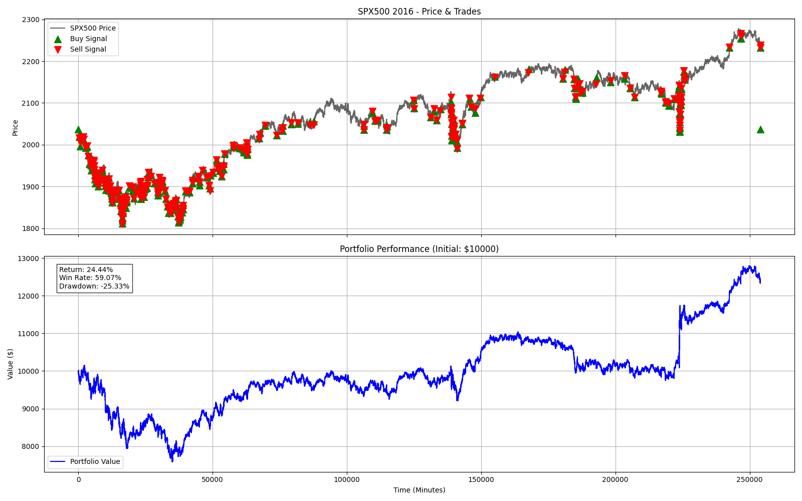

# Trading AI Agent (PPO / Forex / Futures)

A Deep Reinforcement Learning agent trained to trade Forex/Futures markets (SPX500, NAS100) using the Proximal Policy Optimization (PPO) algorithm.

The agent aims for a **Professional Risk profile**:
*   **30x Leverage** (Standard CFDs).
*   **2% Risk Per Trade** (Fixed fractional sizing).
*   **1:3 Risk:Reward Ratio** (Targeting 3% Profit for 1% Risk).
*   **Bi-directional Trading** (Long & Short).

## Project Structure

*   `stock_env.py`: Custom Gymnasium Environment simulating Forex trading (Spread, Margin, Leverage).
*   `train.py`: Training entry point using Stable-Baselines3.
*   `backtest.py`: Verification script to visualize performance on unseen data.
*   `data_processor.py`: Utilities for cleaning and technical indicator generation (RSI, MACD, Ichimoku, etc.).
*   `colab_workspace/`: Self-contained folder for running training in Google Colab.

## Performance

The agent was trained on 2005-2015 data and validated on 2016-2020.

### 2020 Validation (Pandemic Volatility)
Despite the crash, the agent demonstrated resilience (though the 1:3 forced target requires strict discipline):



### 2016 Validation (Stable Market)
In stable trends, the agent captures consistent edge:



## Installation

1.  Clone the repository:
    ```bash
    git clone https://github.com/mccharliesins/trading-ai-agent.git
    cd trading-ai-agent
    ```

2.  Install dependencies:
    ```bash
    pip install -r colab_workspace/requirements.txt
    ```

3.  **Data Setup**:
    *   Place your CSV data in `dataset/ready/SPX500_USD/`.
    *   Ensure columns: `Date`, `Open`, `High`, `Low`, `Close`, `Volume`.

## Usage

**Train the Model:**
```bash
python train.py
```

**Backtest / Visualize:**
```bash
python backtest.py
```

**Google Colab:**
Upload the `colab_workspace` folder to Google Drive and run `TradingBot.ipynb`.

## License
MIT
